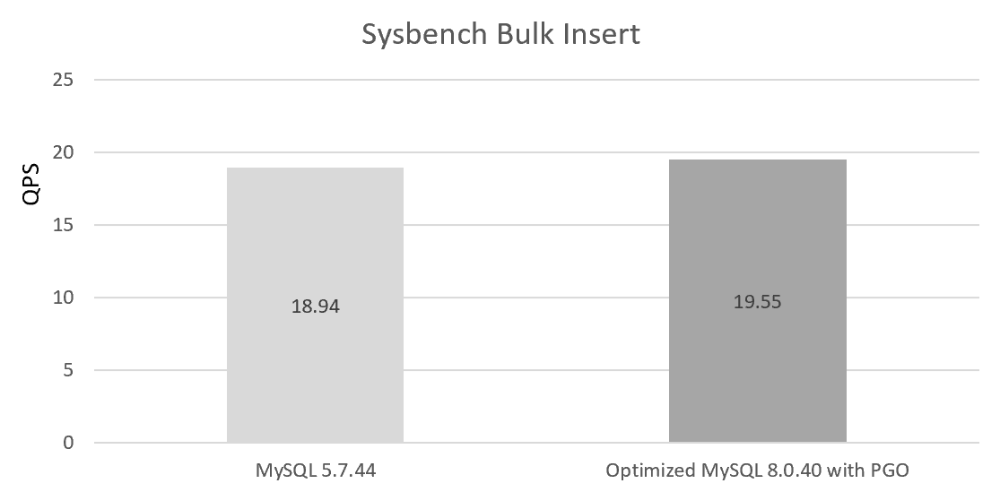

# Mitigating the Increasing Performance Decline

Users tend to notice a decline in low-concurrency performance more easily, while improvements in high-concurrency performance are often harder to perceive. Therefore, maintaining low-concurrency performance is crucial, as it directly affects user experience and the willingness to upgrade [1].

According to extensive user feedback, after upgrading to MySQL 8.0, users have generally perceived a decline in performance, particularly in batch insert and join operations. This downward trend has become more evident in higher versions of MySQL. Additionally, some MySQL enthusiasts and testers have reported performance degradation in multiple sysbench tests after upgrading.

Can these performance issues be avoided? Or, more specifically, how should we scientifically assess the ongoing trend of performance decline? These are important questions to consider.

Although the official team continues to optimize, the gradual deterioration of performance cannot be overlooked. In certain scenarios, there may appear to be improvements, but this does not mean that performance in all scenarios is equally optimized. Moreover, it's also easy to optimize performance for specific scenarios at the cost of degrading performance in other areas.

## 1 The Root Causes of MySQL Performance Decline

In general, as more features are added, the codebase grows, and with the continuous expansion of functionality, performance becomes increasingly difficult to control.

MySQL developers often fail to notice the decline in performance, as each addition to the codebase results in only a very small decrease in performance. However, over time, these small declines accumulate, leading to a significant cumulative effect, which causes users to perceive a noticeable performance degradation in newer versions of
MySQL.

For example, the following figure shows the performance of a simple single join operation, with MySQL 8.0.40 showing a performance decline compared to MySQL 8.0.27:


Figure 1. Significant decline in join performance in MySQL 8.0.40.

The following figure shows the batch insert performance test under single concurrency, with the performance decline of MySQL 8.0.40 compared to version 5.7.44:


Figure 2. Significant decline in bulk insert performance in MySQL 8.0.40.

From the two graphs above, it can be seen that the performance of version 8.0.40 is not good.

Next, let's analyze the root cause of the performance degradation in MySQL from the code level. Below is the ***PT_insert_values_list::contextualize*** function in MySQL 8.0:

```c++
bool PT_insert_values_list::contextualize(Parse_context *pc) {
  if (super::contextualize(pc)) return true;
  for (List_item *item_list : many_values) {
    for (auto it = item_list->begin(); it != item_list->end(); ++it) {
      if ((*it)->itemize(pc, &*it)) return true;
    }
  }

  return false;
}
```

The corresponding ***PT_insert_values_list::contextualize*** function in MySQL 5.7 is as follows:

```c++
bool PT_insert_values_list::contextualize(Parse_context *pc)
{
  if (super::contextualize(pc))
    return true;
  List_iterator<List_item> it1(many_values);
  List<Item> *item_list;
  while ((item_list= it1++))
  {
    List_iterator<Item> it2(*item_list);
    Item *item;
    while ((item= it2++))
    {
      if (item->itemize(pc, &item))
        return true;
      it2.replace(item);
    }
  }

  return false;
}
```

From the code comparison, MySQL 8.0 appears to have more elegant code, seemingly making progress.

Unfortunately, many times it is precisely the motivations behind these code improvements that lead to performance degradation. The MySQL official team replaced the previous ***List*** data structure with a ***deque***, which has become one of the root causes of the gradual performance degradation. Let's take a look at the ***deque***
documentation:

```
std::deque (double-ended queue) is an indexed sequence container that allows fast insertion and deletion at both its 
beginning and its end. In addition, insertion and deletion at either end of a deque never invalidates pointers or 
references to the rest of the elements.

As opposed to std::vector, the elements of a deque are not stored contiguously: typical implementations use a sequence 
of individually allocated fixed-size arrays, with additional bookkeeping, which means indexed access to deque must 
perform two pointer dereferences, compared to vector's indexed access which performs only one.

The storage of a deque is automatically expanded and contracted as needed. Expansion of a deque is cheaper than the 
expansion of a std::vector because it does not involve copying of the existing elements to a new memory location. On 
the other hand, deques typically have large minimal memory cost; a deque holding just one element has to allocate its 
full internal array (e.g. 8 times the object size on 64-bit libstdc++; 16 times the object size or 4096 bytes, 
whichever is larger, on 64-bit libc++).

The complexity (efficiency) of common operations on deques is as follows:
Random access - constant O(1).
Insertion or removal of elements at the end or beginning - constant O(1).
Insertion or removal of elements - linear O(n).
```

As shown in the above description, in extreme cases, retaining a single element requires allocating the entire array, resulting in very low memory efficiency. For example, in bulk inserts, where a large number of records need to be inserted, the official implementation stores each record in a separate deque. Even if the record content is minimal, a deque must still be allocated. The MySQL deque implementation allocates 1KB of memory for each deque to support fast lookups.

```
The implementation is the same as classic std::deque: Elements are held in blocks of about 1 kB each.
```

The official implementation uses 1KB of memory to store index information, and even if the record length is not large but there are many records, the memory access addresses may become non-contiguous, leading to poor cache friendliness. This design was intended to improve cache friendliness, but it has not been fully effective.

It is worth noting that the original implementation used a List data structure, where memory was allocated through a memory pool, providing a certain level of cache friendliness. Although random access is less efficient, optimizing for sequential access to List elements significantly improves performance.

During the upgrade to MySQL 8.0, users observed a significant decline in batch insert performance, and one of the main causes was the substantial change in underlying data structures.

Additionally, while the official team improved the redo log mechanism, this also led to a decrease in MTR commit operation efficiency. Compared to MySQL 5.7, the added code significantly reduces the performance of individual commits, even though overall write throughput has been greatly improved.

Let's examine the core ***execute*** operation of MTR commit in MySQL 5.7.44:

```c++
/** Write the redo log record, add dirty pages to the flush list and 
release the resources. */
void mtr_t::Command::execute()
{
  ut_ad(m_impl->m_log_mode != MTR_LOG_NONE);
  if (const ulint len = prepare_write()) {
    finish_write(len);
  }
  if (m_impl->m_made_dirty) {
    log_flush_order_mutex_enter();
  }
  /* It is now safe to release the log mutex because the
  flush_order mutex will ensure that we are the first one
  to insert into the flush list. */
  log_mutex_exit();
  m_impl->m_mtr->m_commit_lsn = m_end_lsn;
  release_blocks();
  if (m_impl->m_made_dirty) {
    log_flush_order_mutex_exit();
  }
  release_all();
  release_resources();
}
```

Let's examine the core ***execute*** operation of MTR commit in MySQL 8.0.40:

```c++
/** Write the redo log record, add dirty pages to the flush list and 
release the resources. */
void mtr_t::Command::execute() {
  ut_ad(m_impl->m_log_mode != MTR_LOG_NONE);
#ifndef UNIV_HOTBACKUP
  ulint len = prepare_write();
  if (len > 0) {
    mtr_write_log_t write_log;
    write_log.m_left_to_write = len;
    auto handle = log_buffer_reserve(*log_sys, len);
    write_log.m_handle = handle;
    write_log.m_lsn = handle.start_lsn;
    m_impl->m_log.for_each_block(write_log);
    ut_ad(write_log.m_left_to_write == 0);
    ut_ad(write_log.m_lsn == handle.end_lsn);
    log_wait_for_space_in_log_recent_closed(*log_sys, handle.start_lsn);
    DEBUG_SYNC_C("mtr_redo_before_add_dirty_blocks");
    add_dirty_blocks_to_flush_list(handle.start_lsn, handle.end_lsn);
    log_buffer_close(*log_sys, handle);
    m_impl->m_mtr->m_commit_lsn = handle.end_lsn;
  } else {
    DEBUG_SYNC_C("mtr_noredo_before_add_dirty_blocks");
    add_dirty_blocks_to_flush_list(0, 0);
  }
#endif /* !UNIV_HOTBACKUP */
```

By comparison, it is clear that in MySQL 8.0.40, the execute operation in MTR commit has become much more complex, with more steps involved. This complexity is one of the main causes of the decline in low-concurrency write performance.

In particular, the operations ***m_impl-\>m_log.for_each_block(write_log)*** and
**log_wait_for_space_in_log_recent_closed(*log_sys, handle.start_lsn)** have significant overhead. These changes were made to enhance high-concurrency performance, but they came at the cost of low-concurrency performance.

The redo log's prioritization of high-concurrency mode results in poor performance for low-concurrency workloads. Although the introduction of ***innodb_log_writer_threads*** was intended to mitigate low-concurrency performance issues, it does not affect the execution of the above functions. Since these operations have become more complex and require frequent MTR commits, performance has still dropped significantly.

Let's take a look at the impact of the instant add/drop feature on performance. Below is the ***rec_init_offsets_comp_ordinary*** function in MySQL 5.7:

```c++
/******************************************************//**
Determine the offset to each field in a leaf-page record
in ROW_FORMAT=COMPACT.  This is a special case of
rec_init_offsets() and rec_get_offsets_func(). */
UNIV_INLINE MY_ATTRIBUTE((nonnull))
void
rec_init_offsets_comp_ordinary(
/*===========================*/
  const rec_t*    rec,  /*!< in: physical record in
          ROW_FORMAT=COMPACT */
  bool      temp, /*!< in: whether to use the
          format for temporary files in
          index creation */
  const dict_index_t* index,  /*!< in: record descriptor */
  ulint*      offsets)/*!< in/out: array of offsets;
          in: n=rec_offs_n_fields(offsets) */
{   
  ulint   i   = 0;
  ulint   offs    = 0;
  ulint   any_ext   = 0;
  ulint   n_null    = index->n_nullable;
  const byte* nulls   = temp
    ? rec - 1
    : rec - (1 + REC_N_NEW_EXTRA_BYTES);
  const byte* lens    = nulls - UT_BITS_IN_BYTES(n_null);
  ulint   null_mask = 1;

  ...
  ut_ad(temp || dict_table_is_comp(index->table));

  if (temp && dict_table_is_comp(index->table)) {
    /* No need to do adjust fixed_len=0. We only need to
    adjust it for ROW_FORMAT=REDUNDANT. */
    temp = false;
  }
  /* read the lengths of fields 0..n */
  do {
    const dict_field_t* field
      = dict_index_get_nth_field(index, i);
    const dict_col_t* col
      = dict_field_get_col(field);
    ulint     len;
  ...
```

The ***rec_init_offsets_comp_ordinary*** function in MySQL 8.0.40 is as follows:

```c++
/** Determine the offset to each field in a leaf-page record in
ROW_FORMAT=COMPACT.  This is a special case of rec_init_offsets() and
rec_get_offsets().
...
*/
inline void rec_init_offsets_comp_ordinary(const rec_t *rec, bool temp,
                                           const dict_index_t *index,
                                           ulint *offsets) {
  ...
  const byte *nulls = nullptr;
  const byte *lens = nullptr;
  uint16_t n_null = 0;
  enum REC_INSERT_STATE rec_insert_state = REC_INSERT_STATE::NONE;
  uint8_t row_version = UINT8_UNDEFINED;
  uint16_t non_default_fields = 0;

  if (temp) {
    rec_insert_state = rec_init_null_and_len_temp(
        rec, index, &nulls, &lens, &n_null, non_default_fields, row_version);
  } else {
    rec_insert_state = rec_init_null_and_len_comp(
        rec, index, &nulls, &lens, &n_null, non_default_fields, row_version);
  }

  ut_ad(temp || dict_table_is_comp(index->table));
  if (temp) {
    if (dict_table_is_comp(index->table)) {
      /* No need to do adjust fixed_len=0. We only need to
      adjust it for ROW_FORMAT=REDUNDANT. */
      temp = false;
    } else {
      /* Redundant temp row. Old instant record is logged as version 0.*/
      if (rec_insert_state == INSERTED_BEFORE_INSTANT_ADD_OLD_IMPLEMENTATION ||
          rec_insert_state == INSERTED_AFTER_INSTANT_ADD_OLD_IMPLEMENTATION) {
        rec_insert_state = INSERTED_BEFORE_INSTANT_ADD_NEW_IMPLEMENTATION;
        ut_ad(row_version == UINT8_UNDEFINED);
      }
    }
  }

  /* read the lengths of fields 0..n */
  ulint offs = 0;
  ulint any_ext = 0;
  ulint null_mask = 1;
  uint16_t i = 0;
  do {
    /* Fields are stored on disk in version they are added in and are
    maintained in fields_array in the same order. Get the right field. */
    const dict_field_t *field = index->get_physical_field(i);
    const dict_col_t *col = field->col;
    uint64_t len;

    switch (rec_insert_state) {
      case INSERTED_INTO_TABLE_WITH_NO_INSTANT_NO_VERSION:
        ut_ad(!index->has_instant_cols_or_row_versions());
        break;

      case INSERTED_BEFORE_INSTANT_ADD_NEW_IMPLEMENTATION: {
        ut_ad(row_version == UINT8_UNDEFINED || row_version == 0);
        ut_ad(index->has_row_versions() || temp);
        /* Record has to be interpreted in v0. */
        row_version = 0;
      }
        [[fallthrough]];
      case INSERTED_AFTER_UPGRADE_BEFORE_INSTANT_ADD_NEW_IMPLEMENTATION
      case INSERTED_AFTER_INSTANT_ADD_NEW_IMPLEMENTATION: {
        ...
      } break;
      case INSERTED_BEFORE_INSTANT_ADD_OLD_IMPLEMENTATION:
      case INSERTED_AFTER_INSTANT_ADD_OLD_IMPLEMENTATION: {
        ...
      } break;

      default:
        ut_ad(false);
    }
    ...
```

From the above code, it is clear that with the introduction of the instant add/drop column feature, the ***rec_init_offsets_comp_ordinary*** function has become noticeably more complex, introducing more function calls and adding a switch statement that severely impacts cache optimization. Since this function is called frequently, it directly impacts the performance of update index, batch inserts, and joins, resulting in a major performance hit.

Moreover, the performance decline in MySQL 8.0 is not limited to the above; there are many other areas that contribute to the overall performance degradation, especially the impact on the expansion of inline functions. For example, the following code affects the expansion of inline functions:

```c++
void validate_rec_offset(const dict_index_t *index, const ulint *offsets,
                         ulint n, ut::Location L) {
  ut_ad(rec_offs_validate(nullptr, nullptr, offsets));
  if (n >= rec_offs_n_fields(offsets)) {
#ifndef UNIV_NO_ERR_MSGS
    dump_metadata_dict_table(index->table);
    auto num_fields = static_cast<size_t>(rec_offs_n_fields(offsets));
    ib::fatal(L, ER_IB_DICT_INVALID_COLUMN_POSITION, ulonglong{n}, num_fields);
#endif /* !UNIV_NO_ERR_MSGS */
  }
}
```

According to our tests, the ***ib::fatal*** statement severely interferes with inline optimization. For frequently accessed functions, it is advisable to avoid statements that interfere with inline optimization.

Next, let's look at a similar issue. The ***row_sel_store_mysql_field function*** is called frequently, with ***row_sel_field_store_in_mysql_format*** being a hotspot function within it. The specific code is as follows:

```c++
// clang-format off
/** Convert a field in the Innobase format to a field in the MySQL format.
@param[out]     mysql_rec       Record in the MySQL format
@param[in,out]  prebuilt        Prebuilt struct
@param[in]      rec             InnoDB record; must be protected by a page
                                latch
@param[in]      rec_index       Index of rec
@param[in]      prebuilt_index  prebuilt->index
@param[in]      offsets         Array returned by rec_get_offsets()
@param[in]      field_no        templ->rec_field_no or
                                templ->clust_rec_field_no or
                                templ->icp_rec_field_no or sec field no if
                                clust_templ_for_sec is true
@param[in]      templ           row template
@param[in]      sec_field_no    Secondary index field no if the secondary index
                                record but the prebuilt template is in
                                clustered index format and used only for end
                                range comparison.
@param[in]      lob_undo        the LOB undo information.
@param[in,out]  blob_heap       If not null then use this heap for BLOBs */
// clang-format on
[[nodiscard]] static bool row_sel_store_mysql_field(
    byte *mysql_rec, row_prebuilt_t *prebuilt, const rec_t *rec,
    const dict_index_t *rec_index, const dict_index_t *prebuilt_index,
    const ulint *offsets, ulint field_no, const mysql_row_templ_t *templ,
    ulint sec_field_no, lob::undo_vers_t *lob_undo, mem_heap_t *&blob_heap) {
  DBUG_TRACE;
  ...
    } else {
    /* Field is stored in the row. */

    data = rec_get_nth_field_instant(rec, offsets, field_no, index_used, &len);

    if (len == UNIV_SQL_NULL) {
      /* MySQL assumes that the field for an SQL
      NULL value is set to the default value. */
      ut_ad(templ->mysql_null_bit_mask);

      UNIV_MEM_ASSERT_RW(prebuilt->default_rec + templ->mysql_col_offset,
                         templ->mysql_col_len);
      mysql_rec[templ->mysql_null_byte_offset] |=
          (byte)templ->mysql_null_bit_mask;
      memcpy(mysql_rec + templ->mysql_col_offset,
             (const byte *)prebuilt->default_rec + templ->mysql_col_offset,
             templ->mysql_col_len);
      return true;
    } 

    if (DATA_LARGE_MTYPE(templ->type) || DATA_GEOMETRY_MTYPE(templ->type)) {
      ...
      mem_heap_t *heap{};

      if (blob_heap == nullptr) {
        blob_heap = mem_heap_create(UNIV_PAGE_SIZE, UT_LOCATION_HERE);
      } 

      heap = blob_heap;
      data = static_cast<byte *>(mem_heap_dup(heap, data, len));
    } 

    /* Reassign the clustered index field no. */
    if (clust_templ_for_sec) {
      field_no = clust_field_no;
    } 

    row_sel_field_store_in_mysql_format(mysql_rec + templ->mysql_col_offset,
                                        templ, rec_index, field_no, data, len,
                                        sec_field_no);
    ...
```

The ***row_sel_field_store_in_mysql_format*** function ultimately calls ***row_sel_field_store_in_mysql_format_func***.

```c++
/** Convert a non-SQL-NULL field from Innobase format to MySQL format. */
static inline void row_sel_field_store_in_mysql_format(
    byte *dest, const mysql_row_templ_t *templ, const dict_index_t *idx,
    ulint field, const byte *src, ulint len, ulint sec) {
  row_sel_field_store_in_mysql_format_func(
      dest, templ, idx, IF_DEBUG(field, ) src, len IF_DEBUG(, sec));
}   
```

The ***row_sel_field_store_in_mysql_format_func*** function cannot be inlined due to the presence of the ***ib::fatal*** code.

```c++
void row_sel_field_store_in_mysql_format_func(
    byte *dest, const mysql_row_templ_t *templ, const dict_index_t *index,
    IF_DEBUG(ulint field_no, ) const byte *data,
    ulint len IF_DEBUG(, ulint sec_field)) {
  byte *ptr;

  ...

  if (templ->is_multi_val) {
    ib::fatal(UT_LOCATION_HERE, ER_CONVERT_MULTI_VALUE)
        << "Table name: " << index->table->name
        << " Index name: " << index->name;
  }
```

Frequently called inefficient functions, executing tens of millions of times per second, can severely impact join performance.

Let's continue to explore the reasons for performance decline. The following official performance optimization is, in fact, one of the root causes of the decline in join performance. Although certain queries may be improved, it is still one of the reasons for the performance degradation of ordinary join operations.

```c++
commit ffe1726f2542505e486c4bcd516c30f36c8ed5f6 (HEAD)
Author: Knut Anders Hatlen <knut.hatlen@oracle.com>
Date:   Wed Dec 21 14:29:02 2022 +0100

    Bug#34891365: MySQL 8.0.29+ is slower than MySQL 8.0.28 with
    queries using JOINS

    The one-row cache in EQRefIterator was disabled for queries using
    streaming aggregation in the fix for bug#33674441. This was done in
    order to fix a number of wrong result bugs, but it turned out to have
    too big impact on the performance of many queries.

    This patch re-enables the cache for the above queries, and fixes the
    original wrong result bugs in a different way. There were two
    underlying problems that caused the wrong results:

    1) AggregateIterator::Init() does not restore the table buffers to the
    state they had after the last read from the child iterator in the
    previous invocation. The table buffers would have the content from the
    first row in the last group that was returned from the iterator in the
    previous invocation, rather than the contents of the last row read by
    the child iterator, and this made the cache in EQRefIterator return
    wrong values. Fixed by restoring the table buffers in
    AggregateIterator::Init() if the previous invocation had modified
    them.

    2) When the inner tables of an outer join are null-complemented, the
    table buffers are modified to contain NULL values, thereby disturbing
    the cached value for any EQRefIterator reading from one of the
    null-complemented tables. Fixed by making StoreFromTableBuffers()
    store the actual values contained in the table buffer instead of the
    null values, if the table is accessed by EQRefIterator.
    LoadIntoTableBuffers() is taught to restore those values, but
    additionally set the null flags on the columns after restoring them.

    The hypergraph optimizer had another workaround for these wrong
    results (it added a streaming step right before the aggregation). This
    workaround is also removed now.

    Change-Id: I554a90213cae60749dd6407e48a745bc71578e0c
```

MySQL's issues go beyond these. As shown in the analyses above, the performance decline in MySQL is not without cause. A series of small problems, when accumulated, can lead to noticeable performance degradation that users experience. However, these issues are often difficult to identify, making them even harder to resolve.

The so-called 'premature optimization' is the root of all evil, and it does not apply in MySQL development. Database development is a complex process, and neglecting performance over time makes subsequent performance improvements significantly more challenging.

## 2 Solutions to Mitigate MySQL Performance Decline

The main reasons for the decline in write performance are related to MTR commit issues, instant add/drop column, and several other factors. These are difficult to optimize in traditional ways. However, users can compensate for the performance drop through PGO optimization. With a proper strategy, the performance can generally be kept stable.

For batch insert performance degradation, our open-source version [2] replaces the official deque with an improved list implementation. This primarily addresses memory efficiency issues and can partially alleviate performance decline. By combining PGO optimization with our open-source version, batch insert performance can approach that of MySQL 5.7. 



Figure 8-39. Optimized MySQL 8.0.40 with PGO performs roughly on par with version 5.7.

Users can also leverage multiple threads for concurrent batch processing, fully utilizing the improved concurrency of the redo log, which can significantly boost batch insert performance.

Regarding update index issues, due to the inevitable addition of new code, PGO optimization can help mitigate this problem. Our PGO version [2] can significantly alleviate this issue.

For read performance, particularly join performance, we have made substantial improvements, including fixing inline issues and making other optimizations. With the addition of PGO, join performance can be increased by over 30% compared to the official version.


Figure 4. Using PGO, along with our optimizations, can lead to significant improvements in join performance.

We will continue to invest time in optimizing low-concurrency performance. This process is long but involves numerous areas that need improvement.

The open-source version is available for testing, and efforts will persist to improve MySQL performance.

## References

[1] Bin Wang (2024). The Art of Problem-Solving in Software Engineering:How to Make MySQL Better.

[2] [Enhanced for MySQL · GitHub](https://github.com/enhancedformysql)
